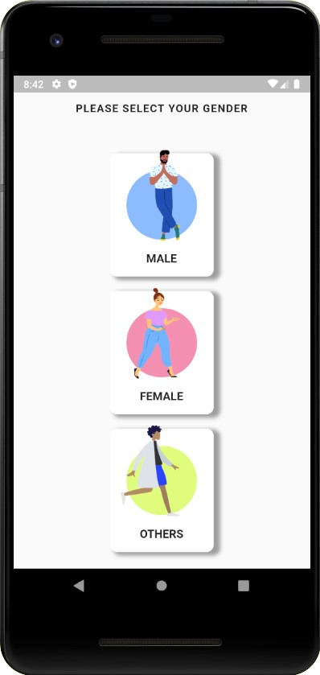
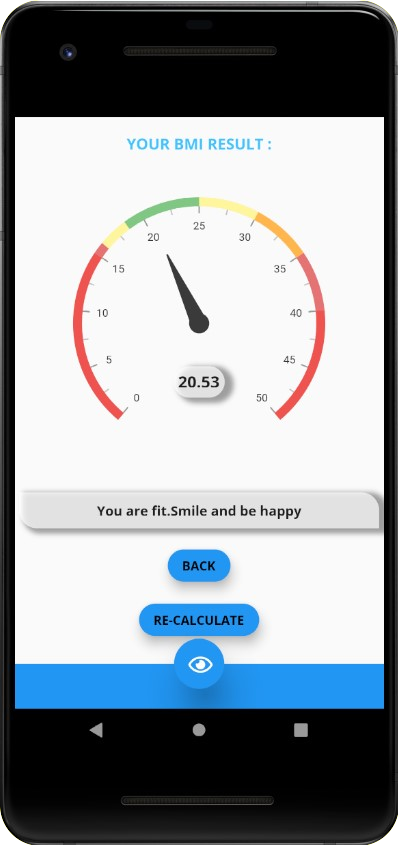
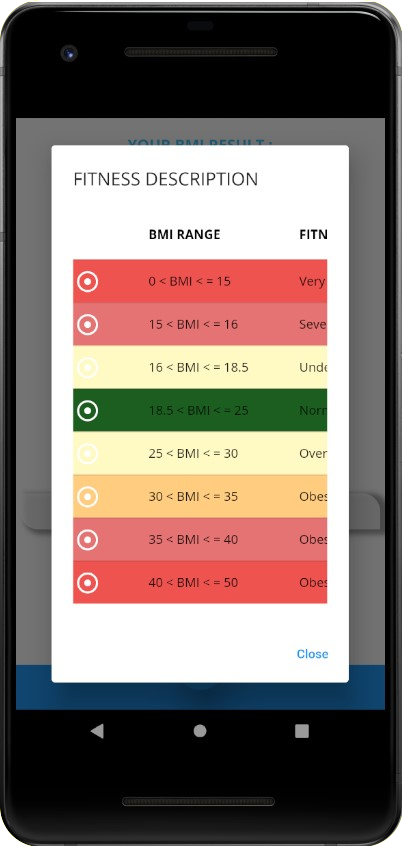
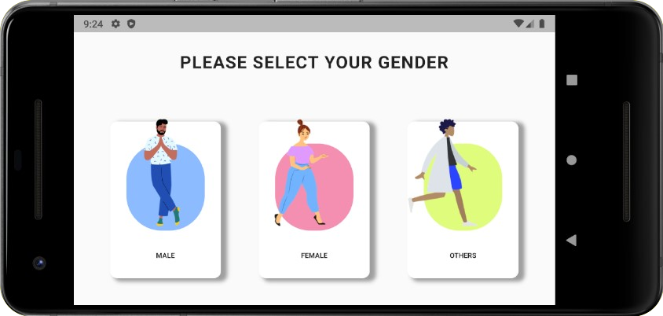
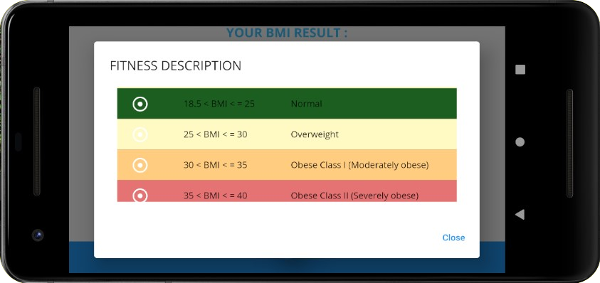

# BMI CALCULATOR APP
 First Open Source Project (Integrated with beautiful Material Designs) :An application to calculate the BMI(Body mass index) of respective user based on their information 
 
<strong>This project is both responsive and adaptive</strong>

## Portrait Mode 
|                                                           |                                                           |
| --------------------------------------------------------- | --------------------------------------------------------- |
|  |   |
|  |  |

## Landscape Mode 
|                                                                                                                    |
| ------------------------------------------------------------------------------------------------------------------ |
|    |
|   |
|   |
|   |

## Created and Maintained By : 
[Triparno Chatterjee](https://github.com/TriparnoChatterjee)
> If you found this project helpful or you learned something from the source code then please consider giving it a :star: on Github and sharing it with your friends via social media 
 

## Getting Started

This project is a starting point for a Flutter application.

A few resources to get you started if this is your first Flutter project:

- [Lab: Write your first Flutter app](https://flutter.dev/docs/get-started/codelab)
- [Cookbook: Useful Flutter samples](https://flutter.dev/docs/cookbook)

For help getting started with Flutter, view our
[online documentation](https://flutter.dev/docs), which offers tutorials,
samples, guidance on mobile development, and a full API reference.
